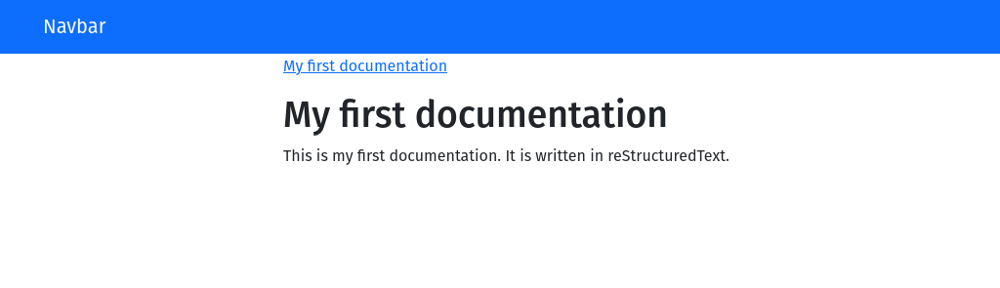

..  include:: /include.rst.txt

================
Getting started
================

This section describes how to use the commandline tool and how to configure it.
The commandline tool is a small wrapper around the core library and can be used
to render RST and Markdown files to HTML.

Create your first documentation
===============================

After :doc:`/installation` you can directly start to create your first documentation.
to do this, create a new directory named ``docs`` and create a file called ``index.rst`` in it.

.. code-block:: text

    My first documentation
    ======================

    This is my first documentation. It is written in reStructuredText.

    .. toctree::
        :maxdepth: 2

        chapter1
        chapter2

Now run the command to render the documentation:

.. code-block:: bash

    $ ./vendor/bin/guides docs

You will find the output in the ``output`` directory and it should look like this:

Now you can start to write your documentation or read the :doc:`./configuration` section
to learn more about the configuration.

.. toctree::
    :hidden:

    configuration

Extending
=========

Like any other component in this repository, the commandline tool can be extended. This can
be done using an extension class, and referencing this class in the configuration file, like
shown for in the :ref:`.extension-configuration` section.
