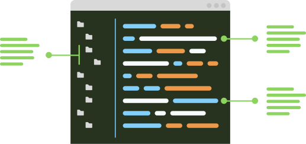

Title
=====

Single line :ref:`ref-line-4`

First :ref:`ref-line-6` of three
second :doc:`doc-line-7`
third `hyperlink-line-8`_

..  note::
    Note text :ref:`ref-line-11`

    Second para
    with :ref:`ref-line-14`

*   List item :ref:`ref-line-16`
*   List item
    :ref:`ref-line-18`

Term :ref:`ref-line-20`
    Definition :ref:`ref-line-21`

:field: :ref:`ref-line-23`
    more :ref:`ref-line-24`

    Quote :ref:`ref-line-26`

#.  Enumerated :ref:`ref-line-28`

| Line :ref:`ref-line-30`
| Line :ref:`ref-line-31`

..  [#] Footnote :ref:`ref-line-33`

=====  ======================
A      B :ref:`ref-line-36`
C      D :ref:`ref-line-37`
=====  ======================

..  note::
    :class: foo

    ..  tip::

        Nested :ref:`ref-line-48`
        and anonymous-line-49__

Section :ref:`ref-line-51`
--------------------------

..  code-block:: php

    literal

Text https://example.org and :ref:`ref-line-58`
